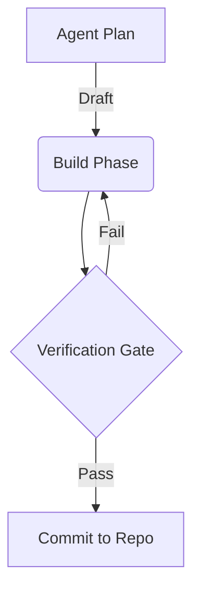

# Nexus Proof-Gated Loop (Curated Public Artifacts)

This repository is **not** the Nexus IOE codebase. It’s a **public portfolio of my build system**: how I orchestrate AI agents and engineering work into a loop that compounds progress instead of compounding chaos.

**Focus:** Plan → Build → Verify → Compound  
**Goal:** Make correctness legible and enforceable, even when development is fast.

## What this shows (quick)
- How I structure an AI-assisted workflow with clear roles (Planner / Builder / Verifier)
- How I define “what must be true” contracts before implementation
- How I gate progress on proofs (tests/oracles/contracts), not confidence
- How I keep refactors from turning into a junk drawer fire

## What this is not
- Not a runnable Nexus release
- Not a source dump
- Not a startup pitch deck

## Start here (5–10 minutes)
1) [Interview Tour](docs/INTERVIEW_TOUR.md) — guided tour
2) [Build Loop](docs/BUILD_LOOP.md) — the loop and roles
3) [Verification Style Guide](docs/VERIFICATION_STYLEGUIDE.md) — how verification stays deterministic
4) [Sanitized Excerpts](docs/SANITIZED_EXCERPTS.md) — concrete examples of contracts and proofs

## Core documentation (fast links)
- **Start Ritual & Roles:** [Start Ritual & Roles](docs/protocols/START_RITUAL_AND_ROLES.md)
- **Doc Authority:** [Doc Authority & Execution Flow](docs/protocols/DOC_AUTHORITY_AND_EXECUTION_FLOW.md)
- **Architecture:** [Nexus Graph](docs/architecture/NEXUS_GRAPH.md) — how the system treats “project > file” and data lineage
- **Interface contract:** [Interface Spec](docs/specs/INTERFACE_SPEC.md) — UI/UX requirements written as buildable constraints
- **Quality bar:** [UX Invariants](docs/specs/UX_INVARIANTS.md) — non-negotiable behavior rules that prevent regressions
- **Fidelity strategy:** [Fidelity Strategy](docs/specs/FIDELITY_STRATEGY.md) — what “correct enough” means and how it’s tested
- **AI delivery loop:** [Agent Loop Protocol](docs/protocols/AGENT_LOOP_PROTOCOL.md) — Plan → Build → Verify → Compound

## Tech stack (context, not a dependency promise)
The internal project uses tools like: Electron, Playwright (E2E), and native rendering engines (e.g., Konva/Tiptap patterns). This repo focuses on **the operating system** for building, not the full implementation.

## Contact
- JB Monu
- LinkedIn: <https://www.linkedin.com/in/jb-monu-9a58543>
- GitHub: <https://github.com/jbmonu87>
