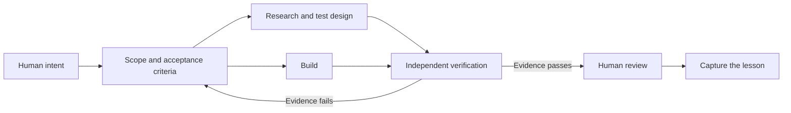

# Nexus: Building Reliably With AI Agents

> A public case study from a private, unshipped Office-style prototype.

## The 20-second version

I created Nexus to learn how to direct AI agents on work where errors are easy to generate and hard to hide. An Office-style product is a useful stress test: a file can open successfully while its layout, behavior, or saved state is still wrong.

I am the creator and product owner. I set product direction, turn ambiguous goals into bounded work, define acceptance criteria, assign separate research, build, and verification roles, review the evidence, and perform final human smoke tests. AI coding agents perform most of the implementation work.

Nexus is private R&D, not a shipped product or a public source-code project. This is a case study in product ownership and AI-enabled execution, not a software-engineering portfolio.

## Why I built it

I wanted practical answers to questions that matter well beyond software development:

- How do you give an AI agent enough context without giving it an unbounded assignment?
- How do you know a confident answer or passing test reflects the real outcome?
- When should one agent build while another independently verifies?
- What evidence should a human require before accepting the work?
- How do lessons become a better operating process instead of disappearing into chat history?

Nexus gives me a demanding environment in which to test those questions rather than answer them only in theory.

## The operating model

```mermaid
flowchart LR
    A[Human intent] --> B[Scope and acceptance criteria]
    B --> C[Research and test design]
    B --> D[Build]
    C --> E[Independent verification]
    D --> E
    E -->|Evidence fails| B
    E -->|Evidence passes| F[Human review]
    F --> G[Capture the lesson]
```

The important idea is simple: **AI output is not proof.** The person accountable for the outcome decides what must be true, what evidence is sufficient, and whether the result is ready to use.

## What exists today

The private prototype currently demonstrates import, editing, and saved project state across presentation, document, and spreadsheet workflows. It also provides a real environment for testing role-separated agent work, evidence requirements, and human review.

The prototype is far from complete. Office-format export is incomplete, editing coverage is uneven, visual and behavioral fidelity still have known gaps, and Nexus has no production customers or public release.

[Read the dated status and claim boundaries](docs/CURRENT_STATUS.md).

## What this work demonstrates

- **Builder's judgment:** choosing a hard problem, making tradeoffs, and turning an idea into something testable
- **AI workflow fluency:** directing agents with explicit context, roles, constraints, and stop conditions
- **Product ownership:** defining the user outcome and deciding what is in or out of scope
- **Operational discipline:** separating implementation from verification and requiring evidence before promotion
- **Learning transfer:** converting failures into reusable practices for other business workflows

It does **not** demonstrate that I personally wrote every line of code, that the system is production-ready, or that AI removes the need for technical experts and human accountability.

## Explore the case study

1. [Case Study](docs/CASE_STUDY.md) — the problem, my role, a representative failure, and the lessons I would carry into a business
2. [Working With AI Agents](docs/WORKFLOW.md) — the operating loop, role boundaries, and a sample work packet
3. [Current Status](docs/CURRENT_STATUS.md) — what exists, what remains incomplete, and what I am not claiming

## Resume-safe description

> Created Nexus, a private Office-style prototype, to learn how to direct AI agents on complex work where visible behavior and file fidelity make errors difficult to hide. Own product direction, task decomposition, acceptance criteria, agent routing, evidence review, and final human testing; AI coding agents perform most implementation work.

## About this repository

This repository contains a deliberately small set of public, sanitized case-study documents. The Nexus source code, internal operating records, and proprietary or employer-related files remain private.

## Contact

- [LinkedIn](https://www.linkedin.com/in/jb-monu-9a58543)
- [GitHub](https://github.com/jbmonu87)
