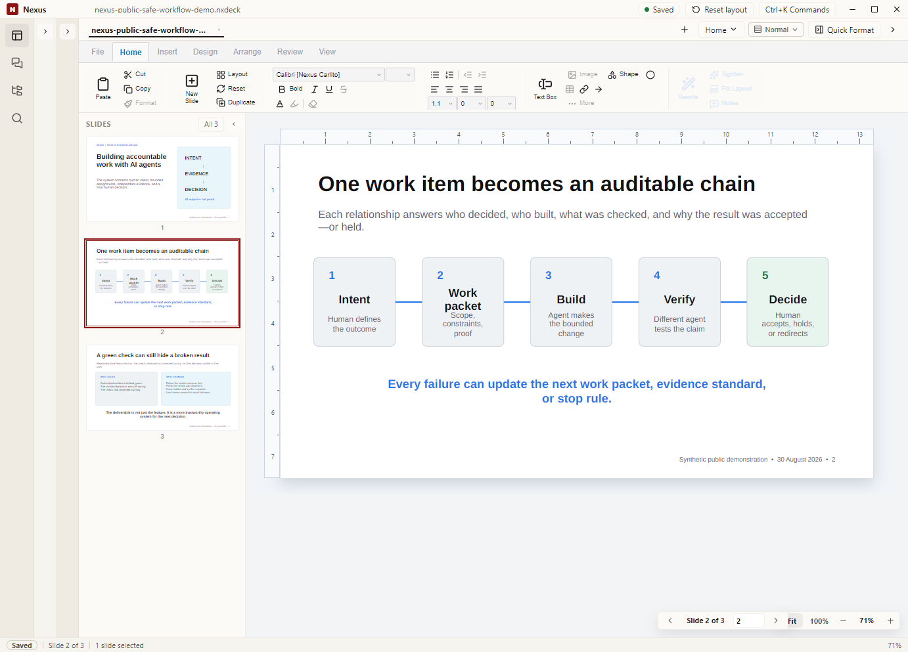
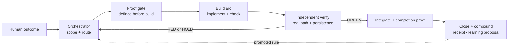

# Nexus: Building Reliably With AI Agents

> A public case study from a private, unshipped Office-style prototype.

## Overview

I created Nexus to learn how to direct AI agents on work where errors are easy to generate and hard to hide. An Office-style product is a useful stress test: a file can open successfully while its layout, behavior, or saved state is still wrong.

I am the creator and product owner. I set product direction, turn ambiguous goals into bounded work, define acceptance criteria, assign separate research, build, and verification roles, review the evidence, and perform final human smoke tests. AI coding agents perform most of the implementation work.

Nexus is private R&D. The source code is not public. This case study focuses on how I direct and check AI-assisted product work.

*Screenshot from the running Nexus prototype, captured August 30, 2026. It uses the synthetic deck provided below; the product remains incomplete.*

## Why I built it

I wanted practical answers to questions that matter well beyond software development:

- How do you give an AI agent enough context without giving it an unbounded assignment?
- How do you know a confident answer or passing test reflects the real outcome?
- When should one agent build while another independently verifies?
- What evidence should a human require before accepting the work?
- How do lessons become a better operating process instead of disappearing into chat history?

Nexus gives me a demanding environment in which to test those questions rather than answer them only in theory.

## The operating loop

```mermaid
flowchart LR
    A[Human outcome] --> B[Orchestrator<br/>scope + route]
    B --> C[Proof gate<br/>defined before build]
    C --> D[Build arc<br/>implement + check]
    D --> E[Independent verify<br/>real path + persistence]
    E -->|GREEN| F[Integrate + completion proof]
    E -->|RED or HOLD| B
    F --> G[Close + compound<br/>receipt · learning proposal]
    G -. promoted rule .-> B
```

After I approve an outcome, the primary orchestrator takes over the process. It scopes the item, chooses the work lane, sets up a separate workspace, and routes the agents. Before the build, it uses an existing biting test or commissions an independent gate. When evidence fails, it routes the next action.

A second, bounded orchestrator owns the build arc and returns one evidence package. It cannot change the product goal, weaken the gate, approve its own work, or merge the result.

The separation is deliberate. The agent that writes the gate is not the builder. The verifier is also a different agent from the builder. Human judgment comes back in for product or scope decisions, destructive actions, and final testing when the result has to be seen or felt.

Agent output gives me something to inspect; it is not evidence by itself. I decide what must be true and whether the evidence is strong enough.

## What the graph records

The diagram is a simplified view of an execution graph. A node is an auditable stage in one bounded work item.

- The work item has one identity and one branch.
- Role-labelled commits show who hardened the scope, wrote the gate, built, and verified.
- Evidence and closeout events record whether the item passed, failed, was held, or later failed a human smoke test.

That means the run can be reconstructed from its history instead of from someone's memory of a conversation.

One run is temporary control flow: work moves through roles, handoffs, evidence, and a decision. The product model is different. It is a still-incomplete way to link workspaces, routines, runs, artifacts, views, and decisions through structure, lineage, and authority.

[See the detailed loop, role boundaries, and compounding method](docs/WORKFLOW.md).

## What exists today

The private prototype currently demonstrates import, editing, and saved project state across presentation, document, and spreadsheet workflows. It also provides a real environment for testing role-separated agent work, evidence requirements, and human review.

The prototype is far from complete. Office-format export is incomplete, editing coverage is uneven, visual and behavioral fidelity still have known gaps, and Nexus has no production customers or public release.

[Read the dated status and claim boundaries](docs/CURRENT_STATUS.md).

## One concrete lesson

A recent verification run targeted the correct slide element, but the click still failed. The element's center point was covered by a transform handle, so the intended control never received the interaction. A valid selector had proved source identity, not usable interaction geometry.

The run was stopped and recorded as a product failure. The workflow now treats target identity and click geometry as separate proof obligations and requires the actual topmost element at the click point when diagnosing this class of failure.

[Read the sanitized run case](docs/AUDITABLE_RUN_CASE.md).

## What I am testing

Nexus is where I practice turning an ambiguous need into a bounded piece of AI-assisted work, checking it against a real outcome, and changing the process when the evidence exposes a flaw. AI agents produce most of the implementation code. The product remains a private prototype, and technical specialists and human accountability remain necessary.

## Explore the case study

1. [Case Study](docs/CASE_STUDY.md): the problem, my role, a representative failure, and the lessons I would carry into a business
2. [Working With AI Agents](docs/WORKFLOW.md): the operating loop, role boundaries, and a sample work packet
3. [One Auditable Run](docs/AUDITABLE_RUN_CASE.md): a sanitized example of a product failure becoming a stronger verification rule
4. [Current Status](docs/CURRENT_STATUS.md): what exists, what remains incomplete, and the limits of my claims
5. [Synthetic demo deck](assets/demo/nexus-public-safe-workflow-demo.pptx): the public-safe input used for the screenshots

## About this repository

This repository contains a deliberately small set of public, sanitized case-study documents. The Nexus source code, internal operating records, and proprietary or employer-related files remain private.

## Contact

- [LinkedIn](https://www.linkedin.com/in/jb-monu-9a58543)
- [GitHub](https://github.com/jbmonu87)
