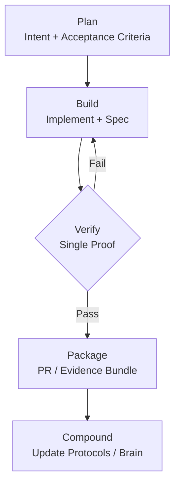

# Nexus Proof-Gated Loop (Curated Public Artifacts)

> **👋 Note to Reviewers (Hiring Managers):**
> This repository is a **Product Architecture & Systems Portfolio**. It contains the actual **Product Requirements Documents (PRDs)**, **Data Schemas**, and **AI Operating Protocols** I designed to orchestrate an AI-native development workflow.
> * **Role Demonstrated:** Technical Product Management & Systems Architecture.
> * **Key Artifact:** Check `docs/protocols/AGENT_LOOP_PROTOCOL.md` to see how I programmatically manage AI agent behavior.
> 
> 

---

This repository is **not** the Nexus IOE codebase. It’s a **public portfolio of my build system**: how I orchestrate AI agents and engineering work into a loop that compounds progress instead of compounding chaos.

**Focus:** Plan → Build → Verify → Compound

**Goal:** Make correctness legible and enforceable, even when development is fast.

## What this shows (quick)

* How I structure an AI-assisted workflow with clear roles (Planner / Builder / Verifier)
* How I define “what must be true” contracts before implementation
* How I gate progress on proofs (tests/oracles/contracts), not confidence
* How I keep refactors from turning into a junk drawer fire

## What this is not

* Not a runnable Nexus release
* Not a source dump
* Not a startup pitch deck

## Start here (5–10 minutes)

1. [Interview Tour](https://www.google.com/search?q=docs/INTERVIEW_TOUR.md) — guided tour
2. [Build Loop](https://www.google.com/search?q=docs/BUILD_LOOP.md) — the loop and roles
3. [Verification Style Guide](https://www.google.com/search?q=docs/VERIFICATION_STYLEGUIDE.md) — how verification stays deterministic
4. [Sanitized Excerpts](https://www.google.com/search?q=docs/SANITIZED_EXCERPTS.md) — concrete examples of contracts and proofs

## Core documentation (fast links)

* **Start Ritual & Roles:** [Start Ritual & Roles](https://www.google.com/search?q=docs/protocols/START_RITUAL_AND_ROLES.md)
* **Doc Authority:** [Doc Authority & Execution Flow](https://www.google.com/search?q=docs/protocols/DOC_AUTHORITY_AND_EXECUTION_FLOW.md)
* **Architecture:** [Nexus Graph](https://www.google.com/search?q=docs/architecture/NEXUS_GRAPH.md) — how the system treats “project > file” and data lineage
* **Interface contract:** [Interface Spec](https://www.google.com/search?q=docs/specs/INTERFACE_SPEC.md) — UI/UX requirements written as buildable constraints
* **Quality bar:** [UX Invariants](https://www.google.com/search?q=docs/specs/UX_INVARIANTS.md) — non-negotiable behavior rules that prevent regressions
* **Fidelity strategy:** [Fidelity Strategy](https://www.google.com/search?q=docs/specs/FIDELITY_STRATEGY.md) — what “correct enough” means and how it’s tested
* **AI delivery loop:** [Agent Loop Protocol](https://www.google.com/search?q=docs/protocols/AGENT_LOOP_PROTOCOL.md) — Plan → Build → Verify → Compound

### System Logic Flow

## Tech stack (context, not a dependency promise)

The internal project uses tools like: Electron, Playwright (E2E), and native rendering engines (e.g., Konva/Tiptap patterns). This repo focuses on **the operating system** for building, not the full implementation.

## Contact

* JB Monu
* LinkedIn: [https://www.linkedin.com/in/jb-monu-9a58543](https://www.linkedin.com/in/jb-monu-9a58543)
* GitHub: [https://github.com/jbmonu87](https://github.com/jbmonu87)
