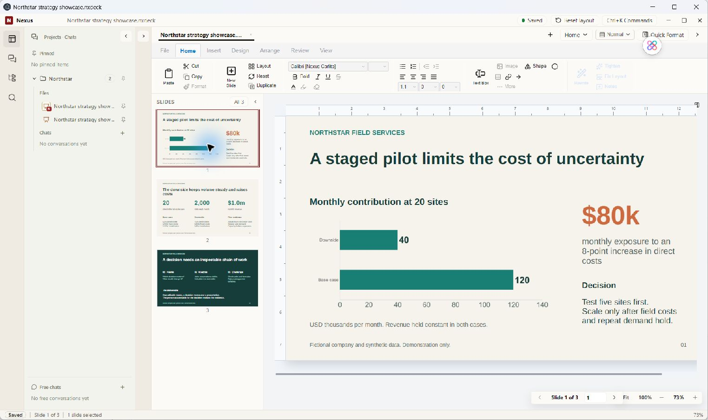
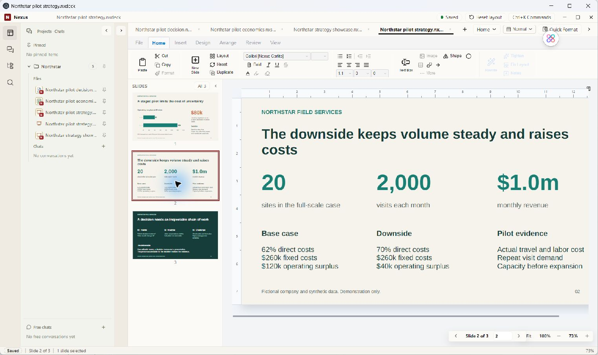
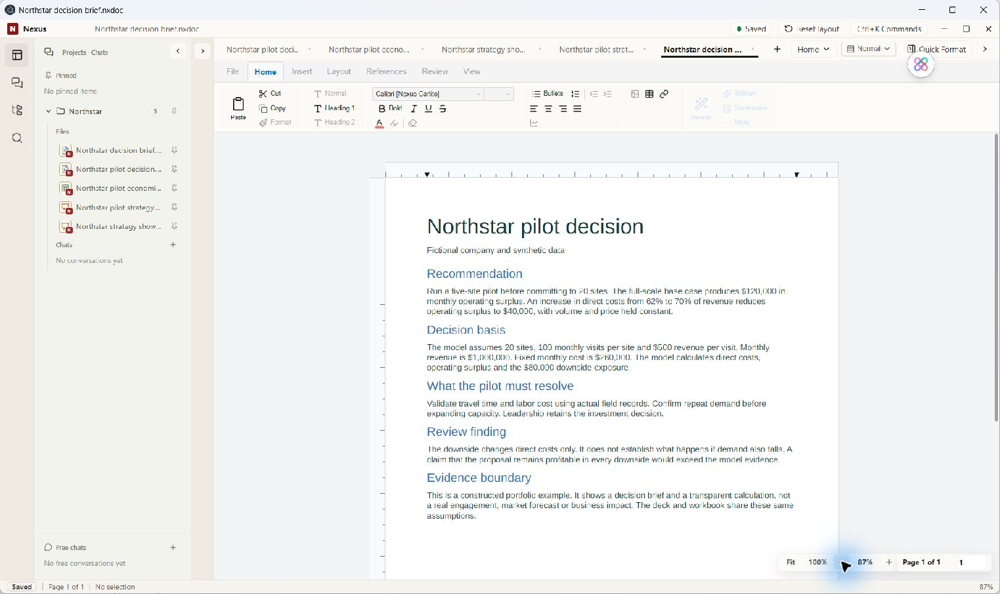
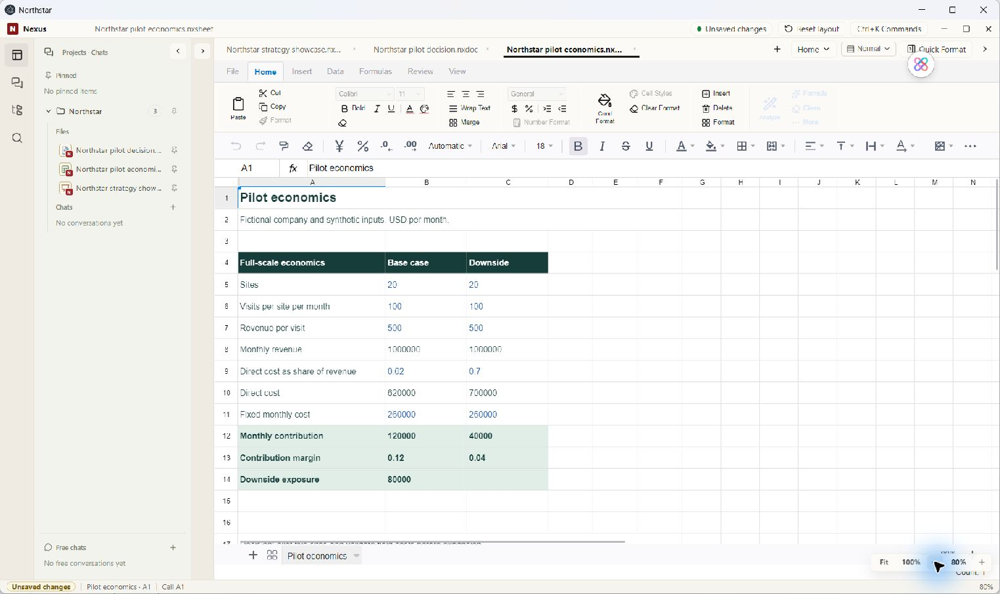

# Business Work Sample: From Assumptions to a Decision

**October 1, 2026 · Fictional company · Synthetic data · AI-assisted portfolio demonstration**

## The decision

Northstar Field Services is a fictional business considering a 20-site rollout. The constructed recommendation is to test five sites first, then review field costs and repeat demand before expanding.

The purpose is to show a connected knowledge-work deliverable: explicit assumptions, an inspectable calculation, a decision memo, and a presentation that explains the tradeoff.

## The calculation

Both full-scale scenarios hold volume and price constant. All financial figures below are USD per month.

| Assumption or result | Base case | Cost downside |
| --- | ---: | ---: |
| Sites | 20 | 20 |
| Visits per site | 100 | 100 |
| Revenue per visit | $500 | $500 |
| Revenue | $1,000,000 | $1,000,000 |
| Direct cost as share of revenue | 62% | 70% |
| Direct cost | $620,000 | $700,000 |
| Fixed cost | $260,000 | $260,000 |
| Operating surplus | $120,000 | $40,000 |
| Surplus margin | 12% | 4% |

Here, **modeled operating surplus** means revenue less the listed direct and fixed costs, before tax and financing. It is a simplified scenario measure, not a complete profit-and-loss statement. **Surplus margin** is that amount divided by revenue.

Revenue = sites × visits per site × revenue per visit. Operating surplus = revenue − direct cost − fixed cost. The difference between the two operating surplus results is $80,000.

The workbook includes formulas for these results. An authoring-engine check reproduced the base and downside calculations; a temporary 75% cost assumption produced negative $10,000 operating surplus, then the input was restored to 70%. This check was performed outside Nexus. No Nexus recalculation claim follows from it.

## Judgment matters

The cost downside is profitable under these specific assumptions. It does **not** prove profitability under every downside: demand, price, and fixed costs could also change. The memo explicitly rejects that broader conclusion.

A five-site pilot is a proposed way to learn, not an optimized or demonstrated investment decision. No five-site economics, market research, pilot results, or real business impact are claimed.

## In the real Nexus editor

The screenshots are unaltered app-window captures. They are not generated product mockups. They show the artifacts in Nexus after importing PPTX, DOCX, and XLSX inputs into native containers.

In an earlier capture iteration, the workbook title was shortened inside Nexus. The title and displayed values survived native save and tab close/reopen. Applied currency and percentage display formats did not survive that tab reopen. Zoom changes also marked the workbook unsaved, as visible in the capture. This is a working-view screenshot, not proof of complete formatting persistence or a cold application restart.

## Download the inputs

- [Presentation — three editable slides](../assets/demo/northstar-strategy-showcase.pptx)
- [Decision memo](../assets/demo/northstar-pilot-decision.docx)
- [Financial model with formulas](../assets/demo/northstar-pilot-economics.xlsx)

These files were authored for this portfolio with AI assistance using document-generation libraries outside Nexus, then imported for the captures. The downloads are the corrected source inputs; they do not include the title edit made in the earlier capture iteration. The final captures use fresh import filenames for the corrected inputs; the final model view retains the input's original title. They are not exports from Nexus and do not demonstrate autonomous in-app generation.

## Capture provenance

Captured October 1, 2026 in a separate synthetic demo project. Nexus ran its existing local dist build with a separate backend, workspace, and application state. The dist directory predates this session; its source commit was not established, so these captures are not presented as a build of the latest source HEAD. No installed Office application was used to edit the files.

The example demonstrates the structure of AI-assisted knowledge work and particular rendered surfaces. It does not establish customer use, general import fidelity, export fidelity, broad preservation, or every editor capability.

[Overview](../README.md) · [Current status](CURRENT_STATUS.md)
