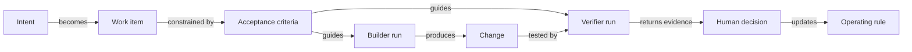

# Working With AI Agents: The Nexus Loop

The Nexus workflow is designed around one principle: **the person accountable for the outcome must be able to inspect why the work should be trusted.**

## The loop

| Stage | Question | Output |
| --- | --- | --- |
| Frame | What user or business outcome matters? | A concise problem statement |
| Scope | What is the smallest useful change? | Boundaries, exclusions, and stop conditions |
| Define proof | What would demonstrate success or expose failure? | Acceptance criteria and an evidence plan |
| Build | What needs to change? | A bounded implementation |
| Verify | Does independent evidence support the claim? | Pass, fail, or hold with reasons |
| Human review | Is the actual result useful and acceptable? | A human decision |
| Compound | What should become reusable? | An improved rule, template, or test |

## Role boundaries

| Role | Owns | Does not own |
| --- | --- | --- |
| Product owner / orchestrator | Intent, scope, tradeoffs, evidence standard, final decision | Pretending agent output is self-validating |
| Research or test designer | Failure model, acceptance criteria, observation method | Implementing around a preferred answer |
| Builder | The scoped implementation and supporting evidence | Weakening the requirement or approving its own work |
| Verifier | Independent evaluation of the claim and evidence | Repairing the result while judging it |
| Human reviewer | User experience, material risk, and acceptance | Delegating accountability to the workflow |

One person may sometimes perform more than one role, but the roles remain explicit. For higher-risk work, they are separated across different agent runs or reviewers.

## How the run becomes inspectable

The sequence is stored as more than a conversation. Each work item has a bounded identity; research, build, and verification runs have explicit roles; commits and evidence receipts connect those roles to the work; and the final disposition records whether the claim passed, failed, or was held.

That produces an execution graph a reviewer can reconstruct:

The wider ambition is an artifact-and-evidence graph connecting claims, source material, edits, tests, and decisions. That remains a direction, not a completed public claim.

## Example of a bounded work packet

### Outcome

When a user selects presentation thumbnail **N**, slide **N** becomes the active slide.

### In scope

- selection from the visible thumbnail list;
- the active-state update; and
- one deterministic check of the selected identifier.

### Out of scope

- thumbnail redesign;
- keyboard navigation;
- multi-selection; and
- unrelated presentation behavior.

### Acceptance criteria

1. Selecting thumbnail 4 activates slide 4.
2. The check fails before the repair and passes afterward.
3. The evidence reads the real active-slide state rather than relying on timing or visual guesswork.
4. A human confirms the interaction in the running product.

### Evidence receipt

A useful completion record answers:

- What changed?
- What exact claim was tested?
- What evidence was produced?
- What was already failing before the work began?
- What remains incomplete or uncertain?
- Who performed the final review?

## Four failure patterns the workflow is meant to catch

1. **The moving finish line:** a failing check is made easier instead of the product being repaired.
2. **The inherited failure:** an existing problem is incorrectly blamed on the new work because no baseline was recorded.
3. **The green proxy:** an automated check passes, but it never observed the result the user sees.
4. **The combined judge and builder:** the same agent implements, interprets ambiguity in its favor, and declares success.

## What the loop is—and is not

This is a practical operating model for directing AI-assisted work. It is not a claim that every task needs multiple agents, that automated tests are infallible, or that human experts can be removed. The level of separation and evidence should match the consequence of being wrong.

[Return to the overview](../README.md) · [Read the case study](CASE_STUDY.md) · [Read one auditable run](AUDITABLE_RUN_CASE.md) · [See current status](CURRENT_STATUS.md)
