# Working With AI Agents: The Nexus Loop

The Nexus workflow is designed around one principle: **the person accountable for the outcome must be able to inspect why the work should be trusted.**

## The loop

| Stage | Question | Output |
| --- | --- | --- |
| Frame and route | What outcome matters, and what is the smallest useful item? | Scope, exclusions, lane, owner, and isolated workspace |
| Harden | What must be true, and which kinds of proof apply? | Locked acceptance criteria, stop conditions, and evidence classes |
| Write the gate | Can a different agent make failure observable before implementation starts? | An independent failing check when the existing proof is inadequate |
| Build | Can the bounded change satisfy the gate without changing it? | Implementation, targeted checks, challenge, and health evidence |
| Verify | Does a different agent reproduce the claim through the real path? | Pass, fail, or hold with evidence |
| Integrate and prove | Is the verified item safe to integrate, and does the actual result work? | Integration plus machine or human completion proof |
| Close and compound | What should the next run know that this one did not? | Run receipt and, when justified, a durable rule or test |

## Two orchestrators, two levels of authority

Nexus currently uses two orchestration layers. The public diagram names roles rather than model brands because model assignments change more often than the operating design.

**The primary orchestrator runs the program.** After I approve a work item, it selects the lane, sets up a separate workspace, routes the roles, and carries the item through verification and closeout. It escalates product behavior, scope, and irreversible decisions to me.

**The build orchestrator runs one bounded build.** It can choose a builder, call for a critique or narrow research, make limited retries, and return the evidence. It cannot change the product goal or the proof it must meet, approve the result, or merge it.

When the two orchestration environments cannot hand work directly to each other, I act as a mechanical relay for one outbound brief and one inbound evidence package. I do not make the routing or retry decisions in between.

## Research is a separate lane

When the diagnosis is genuinely open, the primary orchestrator sends it through research before hardening the work item. It uses several independent research lanes only when disagreement would be useful. Every claim is tied to something the research environment could inspect; observed facts, inferences, and unknowns stay separate.

The primary orchestrator synthesizes that work and locks the acceptance standard before implementation begins. A build-side research scout may still answer a narrow implementation question, but it does not replace the independent research and hardening steps or quietly change the product goal.

## Role boundaries

| Role | Owns | Does not own |
| --- | --- | --- |
| Human product owner | Intended outcome, product behavior, scope, material risk, and final human judgment | Routine routing, retries, or workspace administration |
| Primary orchestrator | Program state, sequencing, role assignment, proof separation, integration, and closeout | Production implementation or changing product intent |
| Researcher / hardener | Root-cause evidence, failure model, acceptance criteria, required evaluation classes, and stop rules | Building against an untested diagnosis or weakening the outcome |
| Independent gate writer | A check that fails for the intended reason before the builder starts | Production code or making its own test pass |
| Build orchestrator | One bounded build arc, retries, critic, health checks, and one evidence return | Product decisions, gate changes, approval, or merge |
| Builder | The scoped implementation and supporting evidence | Writing or weakening its own gate; approving its own work |
| Independent verifier | Reproduction through the real path and a pass, fail, or hold recommendation | Repairing the result while judging it |

The two proof boundaries are fixed: the gate writer and verifier must each be different agents from the builder. Model-family diversity is useful when it is cheap; agent independence matters more than brand names.

## How the run becomes inspectable

The sequence is stored as more than a conversation. In the current system, one bounded work item is one run and one branch. Its nodes are the roles that contribute labelled commits, plus closeout events that Git cannot represent by itself, such as an independent verification result or a later human smoke-test failure.

Each node has an owner, an input, a required output, a stop condition, and evidence. The edges answer questions such as “which gate constrained this build?”, “which change did this verifier test?”, and “which failure produced this new operating rule?”

That produces an execution graph a reviewer can reconstruct:

```mermaid
flowchart LR
    I[Intent] -->|becomes| W[Work item / run]
    W -->|locked by| A[Acceptance criteria + proof classes]
    A -->|expressed as| G[Independent gate]
    G -->|constrains| B[Build]
    B -->|tested by| V[Independent verification]
    V -->|supports| D[Integration or hold decision]
    D -->|recorded in| X[Experience receipt]
    X -->|may propose| R[Operating-rule change]
```

One run is temporary control flow: work moves through stages, handoffs, retries, evidence, and a decision. The product model is different. It is a still-incomplete way to link workspaces, routines, runs, artifacts, views, and decisions through structure, lineage, and authority.

## What happens after approval

The orchestration layer normally handles the process work:

- prepare the isolated branch and workspace, then sequence the roles;
- route setup failures, contract defects, product failures, and plateaus to different next steps;
- keep the builder from changing its own proof obligation; and
- integrate verified work, retire the temporary workspace, and record the outcome.

The orchestration layer has limits. I retain decisions about product behavior, material scope changes, irreversible actions, and final judgment.

## Compounding: how a run changes the next run

The Nexus Brain is versioned operating memory: a short core of durable rules with topic-specific annexes. It carries forward hard-won lessons without treating every observation as doctrine.

1. A failed or unproven idea goes to quarantine, not into the Brain as fact.
2. A green run may propose a lesson only when it has an enforcement anchor, such as a test, guard, or observable seam.
3. An automated learning pass can mine repeated failures, false greens, reverts, and smoke-test mismatches into a reviewable proposal. It cannot change the Brain on its own.
4. A promotion record must state the rule, scope, evidence, enforcement point, duplicate check, and why the lesson should last.
5. The number of Brain edits per closeout is deliberately capped, which forces consolidation instead of memory sprawl.

A run is complete only when its evidence is recorded and any durable lesson has an explicit disposition.

## Example of a bounded work packet

### Outcome

When a user selects presentation thumbnail **N**, slide **N** becomes the active slide.

### In scope

- selection from the visible thumbnail list;
- the active-state update; and
- one deterministic check of the selected identifier.

### Out of scope

- thumbnail redesign;
- keyboard navigation;
- multi-selection; and
- unrelated presentation behavior.

### Acceptance criteria

1. Selecting thumbnail 4 activates slide 4.
2. The check fails before the repair and passes afterward.
3. The evidence reads the real active-slide state rather than relying on timing or visual guesswork.
4. A human confirms the interaction in the running product.

### Evidence receipt

A useful completion record answers:

- What changed?
- What exact claim was tested?
- What evidence was produced?
- What was already failing before the work began?
- What remains incomplete or uncertain?
- Who performed the final review?

## Four failure patterns the workflow is meant to catch

1. **The moving finish line:** a failing check is made easier instead of the product being repaired.
2. **The inherited failure:** an existing problem is incorrectly blamed on the new work because no baseline was recorded.
3. **The green proxy:** an automated check passes, but it never observed the result the user sees.
4. **The combined judge and builder:** the same agent implements, interprets ambiguity in its favor, and declares success.

## Where the loop stops

Low-risk work can use fewer roles. Higher-risk work earns more separation and stronger evidence. Automated checks remain fallible, and human experts remain responsible for consequential decisions.

[Return to the overview](../README.md) · [Read the case study](CASE_STUDY.md) · [Read one auditable run](AUDITABLE_RUN_CASE.md) · [See current status](CURRENT_STATUS.md)
